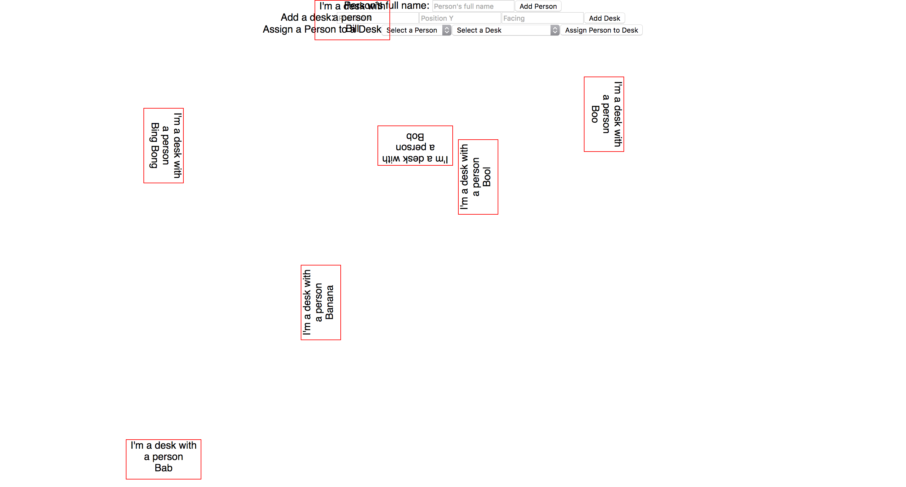
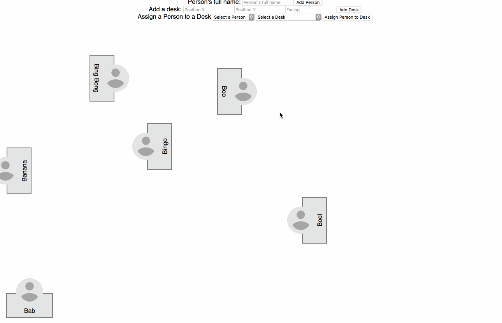
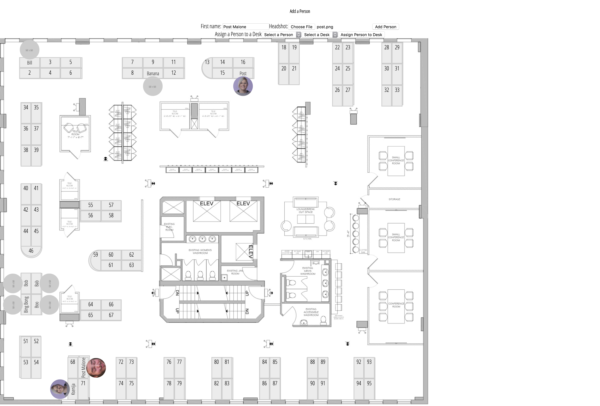

This project was bootstrapped with [Create React App](https://github.com/facebookincubator/create-react-app).

Below you will find some information on how to perform common tasks. 
You can find the most recent version of this guide [here](https://github.com/facebookincubator/create-react-app/blob/master/packages/react-scripts/template/README.md).

### Isn't She Lovely

### Isn't She Wonderful

### Isn't She Precious

### She's a "seating map" "app" (v1)

### Wow

### Some In-Between Anger

### Current State of the Union

